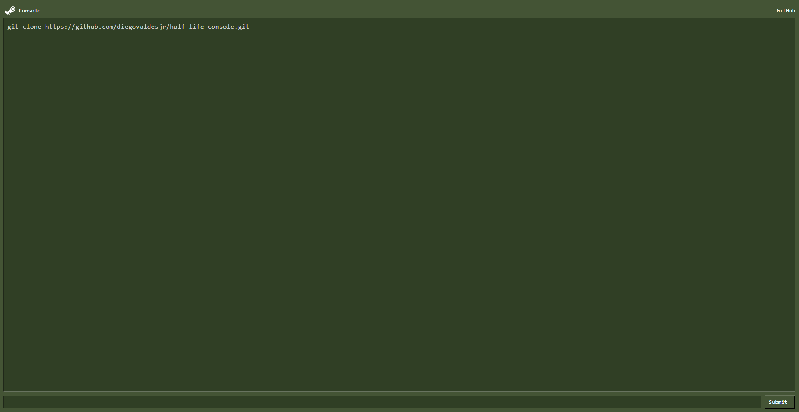

# Half-Life Console GUI


Este proyecto es una interfaz gráfica de usuario (GUI) inspirada en la consola Half-Life. Está construido con React y proporciona una representación visual de la consola del juego. 

Este proyecto fue for fun.



## Índice

- [Características](#características)
- [Requisitos](#requisitos)
- [Instalación](#instalación)
- [Uso](#uso)
- [Tecnologías Utilizadas](#tecnologías-utilizadas)

## Características

- Interfaz moderna y accesible construida con React.
- Simulación de la interfaz grafica de la consola del juego Half-Life.
- Respuesta interactiva en tiempo real a los comandos ingresados.
- Barra de desplazamiento estilizada con sombras para una mejor experiencia visual.
- Adaptación para múltiples resoluciones y dispositivos.

## Requisitos

- Node.js (versión 14 o superior)
- npm o yarn

## Instalación

1. Clona el repositorio:

    ```bash
    git clone https://github.com/diegovaldesjr/half-life-console.git
    ```

2. Navega al directorio del proyecto:

    ```bash
    cd half-life-console
    ```

3. Instala las dependencias del proyecto:

    ```bash
    npm install
    ```

    O si prefieres usar `yarn`:

    ```bash
    yarn install
    ```

## Uso

1. Inicia el servidor de desarrollo:

    ```bash
    npm start
    ```

    O si usas `yarn`:

    ```bash
    yarn start
    ```

2. Abre tu navegador y navega a `http://localhost:3000`. Deberías ver la GUI de la consola de Half-Life funcionando.

## Tecnologías Utilizadas

- **React**: Biblioteca principal para construir la interfaz de usuario.
- **CSS (Sass, Styled Components)**: Para el estilo de la aplicación, asegurando una estética adecuada a la consola de Half-Life.
- **JavaScript (ES6+)**: Para la lógica de los componentes y el manejo de estados.
- **React Hooks**: Para manejar el estado y los efectos dentro de la aplicación.

---

**Half-Life Console GUI** es un proyecto personal inspirado en el clásico Half-Life y no tiene relación oficial con Valve Corporation. Todos los nombres y marcas registradas pertenecen a sus respectivos propietarios.
